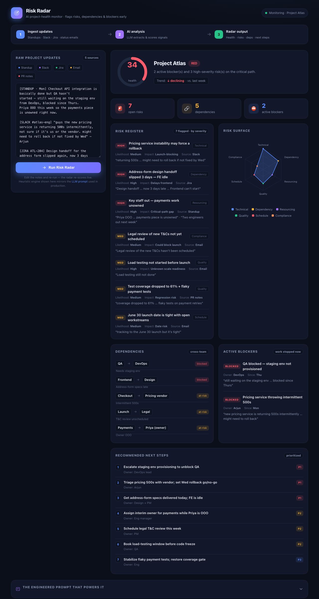

# 🛰️ Risk Radar — AI Project-Health Monitor

> **Challenge attempted:** #1 Risk Radar × #3 Status Summarizer (hybrid).
> An AI workflow that monitors project updates to flag **risks, dependencies,
> and blockers early** — and rolls them into a clear status (health, risks,
> next steps).

**🔗 Live demo:** https://arundhatimahapatro-holymuse.github.io/risk-radar/risk-radar.html
**📦 Repo:** https://github.com/arundhatimahapatro-holymuse/risk-radar



---

## 100-word summary

**Risk Radar** ingests messy, multi-source project updates — standups, Slack,
Jira, status emails, PR notes — and turns them into an early-warning dashboard.
A single engineered Claude prompt extracts and *separates* three things teams
constantly conflate: **risks** (could go wrong), **dependencies** (X waits on Y),
and **blockers** (stopped now), scoring each by impact × likelihood and citing
the exact source phrase as evidence. It outputs strict JSON — overall RED/AMBER/GREEN
health, a risk register, a cross-team dependency map, and prioritized next steps —
that renders live in the dashboard. The browser prototype runs a heuristic mirror
of the prompt, so it demos instantly with no API key.

---

## What's in this folder

| File | What it is |
|------|------------|
| [`risk-radar.html`](./risk-radar.html) | **The prototype** — single-file interactive dashboard. Open in any browser, no build step. |
| [`RISK_RADAR_PROMPT.md`](./RISK_RADAR_PROMPT.md) | **The engineered prompt** — full system/user prompt, schema, worked example, and design rationale. |
| [`dummy-data.md`](./dummy-data.md) | The self-created dummy dataset (fictional "Project Atlas"). |
| `README.md` | This file. |

## Run it

```bash
# Option A — just open the file
open risk-radar.html

# Option B — serve it
python3 -m http.server 4178
# then visit http://localhost:4178/risk-radar.html
```

The dashboard auto-runs on load. Edit the notes in the left panel and hit
**Run Risk Radar** — the radar re-scores live.

## How it works (the workflow)

1. **Ingest** — pull the last 24h of updates from connectors (Slack, Jira,
   email, standup bot). The prototype uses a sample paste-box instead.
2. **AI analysis** — feed the raw text to the Risk Radar Claude prompt; get
   back strict JSON (health, risks, dependencies, blockers, next steps).
3. **Radar output** — render the dashboard, push a digest that @mentions owners
   of RED items, and log the score for week-over-week trend.

## Data

Self-created dummy data only — a fictional product project ("Project Atlas").
No real, confidential, or proprietary information is used. See
[`dummy-data.md`](./dummy-data.md).

## Production note

The prototype's in-browser `analyze()` function is a transparent **heuristic
mirror** of the LLM prompt (keyword + signal scoring) so the demo needs no API
key. In production you replace that one function with a Claude API call using
the prompt in [`RISK_RADAR_PROMPT.md`](./RISK_RADAR_PROMPT.md) — the UI and JSON
contract stay identical.
